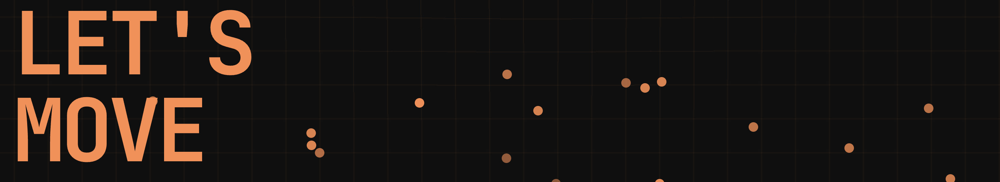

# Data Visualization: Let's move

Page available on: 
https://miriamab.github.io/LetsMove/



This project is a data visualization built with Svelte and Vite. It visualizes personal activity datasets like running, cycling, cardio and strength training.

## :small_orange_diamond: About
This project was created as a semester project for the course Information Design in the Wintersemester 2025/26. It demonstrates how to turn raw activity data into engaging visualizations using Svelte.

## :small_orange_diamond: Getting Started

### Prerequisites
- [Node.js] (v16 or newer recommended)
- [npm] (comes with Node.js)

### Installation
1. Clone the repository or download the project files.
2. Open a terminal in the project root directory.
3. Install dependencies:
	 ```bash
	 npm install
	 ```

### Running the Development Server
Start the local development server with:
```bash
npm run dev
```
